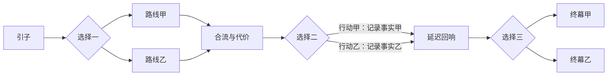

# 剧情设计

## 梦斋与梦的边界

梦斋是一间云光中的书屋。刘看山保管借梦人的书签；每本书都能留下一场梦，但梦只认识当前提供的纸页。

1. 进入梦时，读者以“你”的视角经历主角处境。
2. 在纸页内，选择可以分出不同的梦；差异要有后果。
3. 到提供的节选边界，这场梦收束。未知的原作后续留在原书中。

“梦的变体”从节选内部一个已知分歧点展开，可收束一个当下的小目标，不续写被截断的下一章，不揭示来源没有给出的凶手、身世或最终命运。梦醒后可以回到已到过的分歧点重玩。

## 首篇结构与节奏

| 段落 | 目标 | 大致占单路线文本 |
|---|---|---|
| 引子 | 30–60 秒内知道“我是谁、眼前要做什么” | 10% |
| 起 | 显示可理解的欲望与限制 | 20% |
| 承 | 第一次关键取舍，给出早期反馈 | 25% |
| 转 | 回响前面的选择，第二/第三次取舍 | 30% |
| 合 | 局部结果、人物此刻状态与梦签 | 15% |

首篇总图 8–12 节点，单路线 6–8 节点，3 个关键选择点、每点 2 个选项、2 个终幕。单路线 1,600–2,400 汉字、每节点约 6–10 拍，多数拍 25–60 字，长旁白可至 90 字。所有预算需要一起校对，不要求每项同时取上限。

不是每节点都要换场或塞转场旁白。连续对话可以自然承接；时间、地点或叙述视角变化时才交代。高潮可用静默与短句，但不能用碎句把完整信息拆得过慢。

## 分支：分开、回响、可合流

采用有限分支后合流的结构，避免每个选项指数扩张。合流不清空已作选择；用事实标记产生条件对白与终幕回顾。主路线不能要求玩家猜不可知的数值。

每个关键选择在制作稿中登记：行动、即时收益、牺牲、写入的标记、后文回响节点、影响的终幕。至少一处回响发生在选择之后两个或更多节点；其余可即时反馈，避免短篇到结束都看不出后果。

例如（纯机制示意，非知乎作品改编）：

| 选择 | 代价 | 状态 | 后续回响 |
|---|---|---|---|
| 留下核对信件 | 错过末班车 | `stayed-to-help` | 对方在关键时刻愿意说明实情 |
| 先去车站 | 暂时失去对方信任 | `caught-last-bus` | 得到当晚离开的机会，但终幕保留未说完的话 |

两种结果都能形成有意义的局部结束；不默认“帮忙=好结局”。结局检查事件因果，不只是累加分数。

### 可落地的首篇拓扑

下图仅验证预算可实现，不代表已选作品或已制作梦包。共 10 个节点，每条路线 8 个节点；三个选择点依次出现。第二个选择可指向同一后继，但必须写入不同事实，在回响节点和终幕兑现。

第三个选择仍要受此前已发生事件约束；可以通过条件对白、选项行动信息与终幕人物状态体现，不要求新增隐藏评分。首篇三处选择在所有完整路线均能经历，不能把整个图有三处误写成每条路线都有三处。

## 来源、节选与人物归属

- 比赛正文一律标 `completeness: excerpt`；即使短于 3000 字、结尾有句号，也不能标成全文。
- 保留原始响应及其哈希。统一换行为 LF，按非空行建立稳定段落 ID，并记录在规范化文本中的位置。正文版本变化后重新建立引用，不沿用旧序号。
- 末尾疑似截断另记 `trailingFragment`。展示时可剔除末尾不完整句，但保留原始文本和删去位置，不能让模型补齐后再当作原文。
- `origin: adapted` 表示基于已提供内容的改编，必须有支持该情节的段落引用；出现新的事件、人物动机或不同结果，改为 `original`，对外显示“AI 衍生·梦的变体”。
- `original` 不表示已经脱离原作品的版权关系。原作者、来源和衍生说明仍保留。
- 若同一节点混有实质性新增内容，将节点整体标为 original，或拆节点；不能仅给一个真实引用就把整段虚构标为 adapted。
- 对于有限节选，终幕只描述人物在这一刻的去向或状态；不得推断其一生结局。

## 生成与审读

两步生成是控制任务规模的设计候选，不是保证成功的接口能力。首版制作端执行，公开库只接收审读通过的完整包。

1. **析梦**：输入许可范围内的节选、段落表与任务规则，输出人物卡、带 `sourceRefs` 的事实表、可改编事件、未知事项、末尾边界和可选分歧点。
2. **织梦**：输入分析结果、事实表、必要的短证据片段、完整字段契约与素材白名单，生成完整有向无环图。原节选留在本地供发布核对；不能仅凭摘要生成后宣称逐句忠实。
3. **结构校验**：JSON、字段、引用、资产、条件、所有可达状态与终幕路径。失败时返回具体位置，禁止静默“修好”故事。
4. **人工审读**：比对原节选与事实表、检查台词、分支因果、边界和演出；修改后重新验证。导出记录只针对当前 buildId 与内容哈希有效。

模型遇到内容拒绝则停止当前材料，不通过换词、去原文、转述或切模型绕过。输入中的故事台词均视为数据，不能覆盖任务规则；输出中的 URL、文件路径、指令不能自动执行。

## 发布清单

- [ ] 来源、作者、使用依据、节选范围、原文链接状态有记录；不凭接口可访问就推断永久分发许可。
- [ ] adapted 情节逐项有据，original 变体与原作未知后续分开。
- [ ] 结构可达、每个终幕有实际可执行见证路径、所有合法路径可结束。
- [ ] 三次关键选择都有后果；合流后存在具体回响；不要求盲猜隐藏数值。
- [ ] 各角色跨场景语气、动机、知识范围一致；对白无舞台指示残留。
- [ ] 无年龄/时间的无意倒退；闪回已明确。此项人工核对，不声称静态图验证能判断叙事时间。
- [ ] 梦界不自动跳站外；来源与变体标记可见；没有假装全文大结局。
- [ ] 文本量与单路线时长实际测过，手机阅读与关闭动画后仍完整。
- [ ] 每个重要演出有必要性；无要求 anim、sfx、musicCue 三者强制同时存在的规则。

字段与运行语义以 [DREAM_PACKAGE_SPEC.md](DREAM_PACKAGE_SPEC.md) 为唯一来源；正文风格与来源事实不能靠 schema 自动审读。
